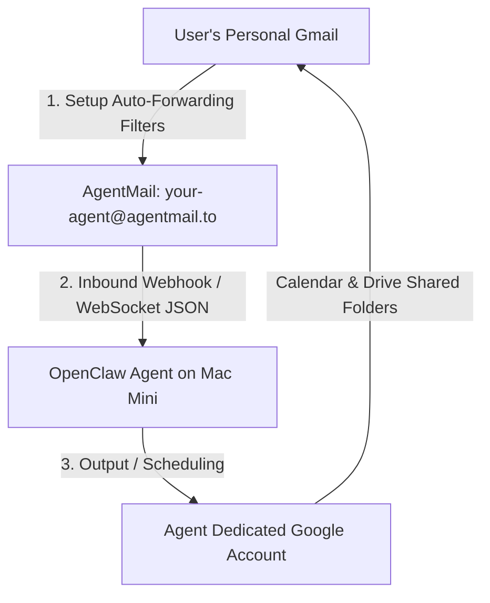

# Comprehensive Guide: OpenClaw Setup, Security Hardening & Maintenance on Apple Silicon Mac Mini

This guide serves as a single, comprehensive, step-by-step instruction manual to install, configure, secure, and maintain your exact OpenClaw environment running **"bare metal"** directly on a new Apple Silicon Mac Mini host. It preserves 100% of your histories, configurations, and memories, while introducing strict, host-level security controls, correcting broken automated backup paths, and configuring local LLMs.

---

## Table of Contents
1. [Phase 0: macOS Host Preparation & OS Hardening](#phase-0-macos-host-preparation--os-hardening)
2. [Phase 1: Homebrew & Tooling Dependencies](#phase-1-homebrew--tooling-dependencies)
3. [Phase 2: Bare-Metal Background Daemon (launchd) Setup](#phase-2-bare-metal-background-daemon-launchd-setup)
4. [Phase 3: Ollama Local AI Model Setup](#phase-3-ollama-local-ai-model-setup)
5. [Phase 4: Bare-Metal OpenClaw Configuration Mappings](#phase-4-bare-metal-openclaw-configuration-mappings)
6. [Phase 5: Advanced Security Hardening & Execution Policies](#phase-5-advanced-security-hardening--execution-policies)
7. [Phase 6: Backup Schedules, Crontabs & Private Git Backup](#phase-6-backup-schedules-crontabs--private-git-backup)
8. [Phase 7: Troubleshooting, Gotchas & Lossless Rollback Plan](#phase-7-troubleshooting-gotchas--lossless-rollback-plan)
9. [Phase 8: Dual-Agent Architecture & Advanced Memory Config](#phase-8-dual-agent-architecture--advanced-memory-config)
10. [Phase 9: Hybrid Sandbox Email & Calendar Architecture](#phase-9-hybrid-sandbox-email--calendar-architecture)


---

## Phase 0: macOS Host Preparation & OS Hardening

Running OpenClaw bare metal directly on the host machine demands strict security measures to protect your local filesystem and API keys.

### 1. Dual-User Account Workflow
Do **not** run OpenClaw under an Administrator account.
* **Standard User Account (`dfadmin`)**: This is the standard, completely unprivileged user account. OpenClaw runs entirely under this session. Even if an agent or skill is ever compromised, it has zero administrative system access.
* **Administrator User Account (`youngjoo`)**: Use this account solely for system maintenance, package updates (e.g. global npm packages, Homebrew taps), and managing elevated privileges. 

### 2. Enable macOS Application Firewall
OpenClaw uses **outbound polling** (WebSockets) to talk to Telegram and external APIs, requiring **zero inbound network ports** from the LAN.
* Navigate to **System Settings > Network > Firewall** under the `youngjoo` account and toggle it **ON**.
* *Important:* Keep SSH active for headless administration but block all other incoming traffic.

### 3. Restrict SSH & Sharing Services
1. Go to **System Settings > General > Sharing**.
2. Toggle **OFF** all unused sharing options (File Sharing, Screen Sharing, Remote Management).
3. Under **Remote Login (SSH)**, set **"Allow access for:"** to **"Only these users:"** and explicitly whitelist the `youngjoo` admin account. *Do not allow the unprivileged `dfadmin` account to establish remote SSH shell connections directly.*

### 4. Turn on FileVault (Full Disk Encryption)
Plaintext API keys and database records are stored in your home directory. Protect against physical data extraction:
* Go to **System Settings > Privacy & Security > FileVault** and toggle it **ON**.

---

## Phase 1: Homebrew & Tooling Dependencies

On macOS, Homebrew is installed in user-space. Because `dfadmin` is a standard unprivileged user, Homebrew installation and binary writing are managed under the `youngjoo` user.

### 1. Install Homebrew
Log into the **`youngjoo`** admin account and execute:
```bash
/bin/bash -c "$(curl -fsSL https://raw.githubusercontent.com/Homebrew/install/HEAD/install.sh)"
```

### 2. Install Required Tools
Run the following Homebrew commands under the Homebrew-owning user account (`youngjoo`) to install essential tools:
```bash
brew install rclone gnu-tar jq gh
```
* **GNU Tar (`gtar`)**: macOS's default `tar` utility is BSD-based. OpenClaw backup scripts rely on **GNU Tar** for advanced path exclusions.
* **GitHub CLI (`gh`)**: Globally accessible under `/opt/homebrew/bin/gh` for managing repository snapshots.

---

## Phase 2: Bare-Metal Background Daemon (launchd) Setup

Rather than running OpenClaw in a Docker container, we run it as a native macOS background LaunchAgent daemon under the `dfadmin` session.

### 1. Register the LaunchAgent Daemon
Log into the **`dfadmin`** account and run the built-in installer to create, register, and bootstrap the `launchd` configuration:
```bash
openclaw gateway install --runtime node
```
This registers a LaunchAgent plist file at `/Users/dfadmin/Library/LaunchAgents/ai.openclaw.gateway.plist` configured to restart OpenClaw automatically if it crashes or the system boots.

### 2. Manage the Service
Use the following commands to control the background daemon under `dfadmin`:
* **Start Gateway**: `openclaw gateway start`
* **Stop Gateway**: `openclaw gateway stop`
* **Check Service State**: `openclaw gateway status`

### 3. Session Persistence & Architecture: LaunchAgent vs. LaunchDaemon
Previously, running OpenClaw in a container required keeping the `dfadmin` account graphically logged in so that the Docker Desktop GUI and virtual machine remained running. Under this native bare-metal setup, a graphical login is no longer required.

#### A. Keep `dfadmin` Logged In via Fast User Switching (Recommended)
Because OpenClaw runs as a native background **LaunchAgent** under `dfadmin`'s session:
* You do **not** need a graphical GUI window open. You can lock the screen, close all windows, or use **Fast User Switching** to log into the `youngjoo` admin account. 
* As long as the `dfadmin` session remains loaded in the background (i.e., you do not explicitly select "Log Out dfadmin" from the Apple menu), OpenClaw will continue running natively 24/7 in the background with near-zero resource usage.

#### B. Why We Do Not Use System-Level LaunchDaemons
To have OpenClaw start up automatically at boot without *ever* logging in, it would need to be registered as a system-level **LaunchDaemon** at `/Library/LaunchDaemons/`. However, this introduces significant risks and downsides:
1. **Privilege Escalation Risk (Root Access)**: LaunchDaemons run as `root` by default. If the configuration to restrict execution to `dfadmin` is ever omitted, modified, or corrupted, the agent will run with full superuser permissions. This violates our standard-user sandbox model.
2. **Operational Overhead**: Plist files in `/Library/LaunchDaemons/` are owned by root. The standard `dfadmin` user would lose the ability to start, stop, or manage the service using user-level commands, requiring `sudo` or switching to `youngjoo` for basic troubleshooting.
3. **Loss of GUI/WindowServer Context**: LaunchDaemons have zero access to the macOS graphical server. If the agent is ever programmed to run skills that automate GUI applications (like opening Apple Notes or Reminders), it will fail silently.
4. **Environment Isolation**: LaunchDaemons do not inherit standard shell environments or `.zshrc` mappings, requiring every tool, environment variable, and path to be rigidly hardcoded.

---

## Phase 3: Ollama Local AI Model Setup & launchd Daemon

Ollama runs locally on the host's Apple Silicon GPU. It is installed and run in user-space as a native background **LaunchAgent** under the **`dfadmin`** account.

### 1. Register the Ollama LaunchAgent Daemon
To ensure Ollama starts automatically at login with strict loopback binding and full hardware acceleration enabled, register it as a native macOS LaunchAgent:

1. Create the plist configuration at `/Users/dfadmin/Library/LaunchAgents/ai.openclaw.ollama.plist`:
```xml
<?xml version="1.0" encoding="UTF-8"?>
<!DOCTYPE plist PUBLIC "-//Apple//DTD PLIST 1.0//EN" "http://www.apple.com/DTDs/PropertyList-1.0.dtd">
<plist version="1.0">
  <dict>
    <key>Label</key>
    <string>ai.openclaw.ollama</string>
    <key>Comment</key>
    <string>OpenClaw Ollama Local LLM Server</string>
    <key>RunAtLoad</key>
    <true/>
    <key>KeepAlive</key>
    <true/>
    <key>ProgramArguments</key>
    <array>
      <string>/opt/homebrew/bin/ollama</string>
      <string>serve</string>
    </array>
    <key>EnvironmentVariables</key>
    <dict>
      <key>OLLAMA_HOST</key>
      <string>127.0.0.1</string>
      <key>OLLAMA_FLASH_ATTENTION</key>
      <string>1</string>
      <key>OLLAMA_KV_CACHE_TYPE</key>
      <string>q8_0</string>
      <key>HOME</key>
      <string>/Users/dfadmin</string>
    </dict>
    <key>StandardOutPath</key>
    <string>/Users/dfadmin/Library/Logs/openclaw/ollama.log</string>
    <key>StandardErrorPath</key>
    <string>/Users/dfadmin/Library/Logs/openclaw/ollama.err.log</string>
    <key>WorkingDirectory</key>
    <string>/Users/dfadmin</string>
  </dict>
</plist>
```

2. Bootstrap and start the Ollama background daemon:
```bash
launchctl bootstrap gui/$(id -u) ~/Library/LaunchAgents/ai.openclaw.ollama.plist
```

### 2. GPU Optimizations Explained
* **`OLLAMA_HOST="127.0.0.1"`**: Binds Ollama strictly to loopback, blocking any network exposure.
* **`OLLAMA_FLASH_ATTENTION="1"`**: Accelerates Metal GPU parallel token generation.
* **`OLLAMA_KV_CACHE_TYPE="q8_0"`**: Uses highly optimized 8-bit quantized caching, cutting memory consumption in half without loss in precision.

### 3. Pull Local Models
Download the primary model and local fallback:
```bash
/opt/homebrew/bin/ollama pull qwen3.5:9b
/opt/homebrew/bin/ollama pull gemma4:e4b
```

---

## Phase 4: Bare-Metal OpenClaw Configuration Mappings

The bare-metal setup reads all configuration parameters natively from macOS paths rather than mapped virtual container paths.

### 1. Local Shell Aliases (`~/.zshrc`)
Comment out the old container execution variable inside `/Users/dfadmin/.zshrc` to ensure the host CLI acts natively:
```bash
# Disabled for bare-metal migration. Uncomment to rollback to Docker.
# export OPENCLAW_CONTAINER=openclaw-sandbox

oc() { openclaw "$@"; }
```

### 2. Configuration: `openclaw.json` (`~/.openclaw/openclaw.json`)
Configure your `/Users/dfadmin/.openclaw/openclaw.json` exactly as follows. All paths are resolved to `/Users/dfadmin/` and network bindings are secured.

> [!IMPORTANT]
> **Ollama Network Binding (Bare Metal vs. Docker)**:
> * **Bare Metal (Active)**: In `models.providers.ollama.baseUrl`, you **must** use `"http://127.0.0.1:11434"`. This routes local LLM queries directly via your host's native loopback port.
> * **Docker (Legacy/Rollback)**: The container used `"http://host.docker.internal:11434"`. Using `host.docker.internal` on bare metal will fail immediately with `getaddrinfo ENOTFOUND host.docker.internal` because it is a virtual hostname that only exists inside Docker's network bridge.

> [!WARNING]
> **Legacy Path Pollution (`/home/node`)**:
> Transitioning to bare metal requires a complete sweep of all internal state databases. Stale container paths (`/home/node/.openclaw/...`) inside active session pointer files (`*.trajectory-path.json`), `cron/jobs.json`, and `plugins/installs.json` will cause the gateway to fail during execution with silent `ENOENT` directory creation errors. Follow the path sweep commands in Phase 7 to guarantee a clean state.

```json
{
  "auth": {
    "profiles": {
      "google:default": {
        "provider": "google",
        "mode": "api_key"
      },
      "anthropic:default": {
        "provider": "anthropic",
        "mode": "api_key"
      },
      "ollama:default": {
        "provider": "ollama",
        "mode": "api_key"
      }
    }
  },
  "models": {
    "providers": {
      "ollama": {
        "baseUrl": "http://127.0.0.1:11434",
        "apiKey": "ollama-local",
        "auth": "api-key",
        "api": "ollama",
        "params": {
          "num_ctx": 32768
        }
      }
    }
  },
  "agents": {
    "defaults": {
      "model": {
        "primary": "ollama/gemma4:12b-it-qat",
        "fallbacks": [
          "ollama/qwen3.5:9b",
          "google/gemini-3.5-flash",
          "anthropic/claude-sonnet-4-6"
        ]
      },
      "models": {
        "google/gemini-2.5-flash": {
          "alias": "flash"
        },
        "anthropic/claude-sonnet-4-6": {
          "alias": "sonnet",
          "params": {
            "cacheRetention": "short"
          }
        },
        "ollama/gemma4:12b-it-qat": {
          "alias": "gemma4-12b-qat"
        },
        "ollama/gemma4:12b": {
          "alias": "gemma4-12b"
        },
        "ollama/qwen3.5:9b": {
          "alias": "qwen"
        },
        "ollama/gemma4:e4b": {
          "alias": "gemma4"
        },
        "google/gemini-3.1-pro-preview": {
          "alias": "pro"
        },
        "google/gemini-3.5-flash": {
          "alias": "flash35"
        }
      },
      "workspace": "/Users/dfadmin/.openclaw/workspace",
      "compaction": {
        "mode": "safeguard",
        "reserveTokensFloor": 20000
      },
      "heartbeat": {
        "every": "1h",
        "target": "telegram"
      },
      "contextPruning": {
        "mode": "cache-ttl",
        "ttl": "1h"
      },
      "contextTokens": 32000
    },
    "list": [
      {
        "id": "main"
      }
    ]
  },
  "tools": {
    "profile": "coding",
    "web": {
      "search": {
        "provider": "gemini"
      }
    },
    "exec": {
      "host": "gateway",
      "security": "allowlist",
      "ask": "on-miss"
    }
  },
  "commands": {
    "native": "auto",
    "nativeSkills": "auto",
    "restart": true,
    "ownerDisplay": "raw"
  },
  "session": {
    "dmScope": "per-channel-peer"
  },
  "channels": {
    "telegram": {
      "enabled": true,
      "dmPolicy": "pairing",
      "groups": {
        "*": {
          "requireMention": true
        }
      },
      "groupPolicy": "open",
      "streaming": {
        "mode": "partial"
      },
      "accounts": {
        "default": {
          "botToken": "YOUR_MAIN_TELEGRAM_BOT_TOKEN"
        }
      }
    }
  },
  "gateway": {
    "port": 18789,
    "mode": "local",
    "bind": "loopback",
    "auth": {
      "mode": "token",
      "token": "YOUR_GATEWAY_AUTH_TOKEN"
    },
    "tailscale": {
      "mode": "off",
      "resetOnExit": false
    },
    "nodes": {
      "denyCommands": [
        "camera.snap",
        "camera.clip",
        "screen.record",
        "contacts.add",
        "calendar.add",
        "reminders.add",
        "sms.send"
      ]
    }
  },
  "bindings": [
    {
      "type": "route",
      "agentId": "main",
      "match": {
        "channel": "telegram",
        "accountId": "default"
      }
    }
  ],
  "plugins": {
    "allow": [
      "google",
      "telegram",
      "anthropic",
      "memory-core",
      "ollama",
      "active-memory"
    ],
    "entries": {
      "google": {
        "enabled": true
      },
      "telegram": {
        "enabled": true
      },
      "anthropic": {
        "enabled": true
      },
      "ollama": {
        "enabled": true
      },
      "memory-core": {
        "enabled": true,
        "config": {
          "dreaming": {
            "enabled": true,
            "model": "flash35"
          }
        }
      },
      "active-memory": {
        "enabled": true,
        "config": {
          "agents": [
            "main"
          ],
          "allowedChatTypes": [
            "direct"
          ],
          "modelFallback": "google/gemini-3-flash",
          "queryMode": "recent",
          "promptStyle": "balanced",
          "timeoutMs": 15000,
          "maxSummaryChars": 220,
          "persistTranscripts": false,
          "logging": true
        }
      }
    },
    "bundledDiscovery": "compat"
  }
}
```

---

## Phase 5: Advanced Security Hardening & Execution Policies

Because Docker is removed, OpenClaw has direct access to the host's standard user space. We lock down access using strict application-level controls:

### 1. Loopback-Only Network Binding
In `openclaw.json`, `"bind"` is set to `"loopback"`. This forces OpenClaw to bind strictly to localhost (`127.0.0.1`), physical blocking any other computer on your LAN or WiFi from hitting the local WebSocket Gateway port `18789`.

### 2. Directory Permissions Lockdown
Protect configurations, API keys, and memory DBs on the host:
```bash
chmod -R u=rwX,go= /Users/dfadmin/.openclaw
```
This recursively restricts read, write, and execute permissions exclusively to the `dfadmin` user, revoking all access from any other user accounts on the Mac Mini.

### 3. Cautious Shell Execution Policy
OpenClaw enforces a human-in-the-loop validation process before executing *any* shell command or script:
```bash
openclaw exec-policy preset cautious
```
This configures `defaults.security` to `"allowlist"` and `defaults.ask` to `"on-miss"`. The agent **cannot** run shell tools directly. For every command execution, OpenClaw stops and sends an interactive verification request to your Telegram chat (`@JooJJBot`). It will only execute if you tap **Approve**.

* **Socket Fix**: Ensure `/Users/dfadmin/.openclaw/exec-approvals.json` maps `"socket.path"` to `/Users/dfadmin/.openclaw/exec-approvals.sock` rather than container legacy paths.

---

## Phase 6: Backup Schedules, Crontabs & Private Git Backup

Legacy automated snapshot backups were failing due to WSL2 path discrepancies (`/home/young/`). Both cron check scripts and active user crontabs have been fully repaired and corrected to macOS host paths.

### 1. Repaired Backup Verification Scripts
All path variables have been corrected to `/Users/dfadmin/` in the script directory:
* `/Users/dfadmin/openclaw-win/scripts/backup-check.sh`
* `/Users/dfadmin/openclaw-win/scripts/antigravity-backup-check.sh`

### 2. Active macOS Crontab Schedule
Open the `dfadmin` crontab using `crontab -e` and confirm that it matches the corrected host-level schedules:
```cron
# OpenClaw Snapshot Backups
0 3 * * * /Users/dfadmin/openclaw-win/scripts/openclaw-backup.sh >> /Users/dfadmin/.openclaw/logs/openclaw-backup-cron.log 2>&1
0 * * * * /Users/dfadmin/openclaw-win/scripts/backup-check.sh >> /Users/dfadmin/.openclaw/logs/openclaw-backup-check.log 2>&1

# Antigravity Snapshot Backups
15 3 * * * /Users/dfadmin/openclaw-win/scripts/antigravity-backup.sh >> /Users/dfadmin/.openclaw/logs/antigravity-backup-cron.log 2>&1
15 * * * * /Users/dfadmin/openclaw-win/scripts/antigravity-backup-check.sh >> /Users/dfadmin/.openclaw/logs/antigravity-backup-check.log 2>&1
```

### 3. Private Git Workspace Backup
Keep a persistent, encrypted Git history of your agent memories and custom skills:
1. Navigate to the local workspace:
   ```bash
   cd /Users/dfadmin/.openclaw/workspace
   ```
2. Check Git status and stage files:
   ```bash
   git status
   git add .
   git commit -m "Snapshot backup: bare-metal transition"
   ```
3. Push to your private remote repository:
   ```bash
   git push origin main
   ```

---

## Phase 7: Troubleshooting, Gotchas & Lossless Rollback Plan

### 1. Troubleshooting Tools
Use native OpenClaw tools to inspect the active bare-metal daemon:
* **Gateway Logs**: `tail -f ~/Library/Logs/openclaw/gateway.log`
* **CLI Status**: `openclaw status` (runs natively on loopback)
* **Model Test**: `openclaw model test ollama/qwen3.5:9b`

### 2. Loss-Free Rollback Procedure (Revert to Docker)
If you ever need to return to running OpenClaw in a Docker container, we have preserved the original Docker-mapped configuration backup: `/Users/dfadmin/.openclaw/openclaw.json.bak.docker`.

Follow these simple steps:
1. **Stop & Uninstall the Bare-Metal Service**:
   ```bash
   openclaw gateway stop
   openclaw gateway uninstall
   ```
2. **Re-Enable old Container Shell Shortcuts**:
   Open `/Users/dfadmin/.zshrc` and uncomment the container environment variable:
   ```bash
   export OPENCLAW_CONTAINER=openclaw-sandbox
   ```
3. **Revert Path Config Mapping**:
   ```bash
   cp /Users/dfadmin/.openclaw/openclaw.json.bak.docker /Users/dfadmin/.openclaw/openclaw.json
   ```
4. **Relaunch the Docker Sandbox Container**:
   ```bash
   docker start openclaw-sandbox
   ```
   All of your historical files, memories, and databases are preserved intact inside the `~/.openclaw` directory, and OpenClaw will resume containerized execution immediately.

### 3. Stale Container Paths Gotcha (`/home/node`)
If the Telegram bot stays stuck in a `...typing` state or hangs indefinitely, the gateway is likely encountering a silent directory creation exception:
```
ENOENT: no such file or directory, mkdir '/home/node'
```
Even after updating `openclaw.json`, legacy Docker path references (`/home/node`) can remain hardcoded inside active runtime database records. 

To completely sweep the filesystem and align all state files with your standard macOS user directory (`/Users/dfadmin`):

1. **Re-align Session Trajectory Pointers**:
   ```bash
   find /Users/dfadmin/.openclaw/agents/main/sessions/ -name "*.trajectory-path.json" -exec sed -i '' 's|/home/node|/Users/dfadmin|g' {} +
   ```
2. **Re-align Scheduled Cron Tasks**:
   ```bash
   sed -i '' 's|/home/node|/Users/dfadmin|g' /Users/dfadmin/.openclaw/cron/jobs.json
   ```
3. **Re-align Plugin Registries**:
   ```bash
   sed -i '' 's|/home/node|/Users/dfadmin|g' /Users/dfadmin/.openclaw/plugins/installs.json
   ```
4. **Clean Session Locks & Refresh Integrities**:
   Run the CLI doctor utility to purge hung locks and refresh state parameters:
   ```bash
   openclaw doctor --fix
   ```
5. **Recycle the Gateway Service**:
   ```bash
   openclaw gateway stop
   openclaw gateway start
   ```

---

## Phase 8: Dual-Agent Architecture & Advanced Memory Config

To keep standard chat interactions fast while isolating complex, long-running coding tasks, we have implemented a Dual-Agent Architecture.

### 1. Dual-Agent Model Assignments
We configured two distinct Telegram bots, routing to two specialized OpenClaw agents:
* **Main Agent (`@JooJJBot`)**: Handles standard queries and chat. 
  * **Primary Model**: `ollama/gemma4:12b-it-qat` (Unified QAT reasoning)
  * **Fallback Model**: `ollama/qwen3.5:9b`
  * **Workspace**: `/Users/dfadmin/.openclaw/workspace`
* **Heavy Agent (`@DFHeavyAgent_bot`)**: Isolated agent for complex task execution and internet routing.
  * **Primary Model**: `google/gemini-3.5-flash`
  * **Fallback Model**: `anthropic/claude-sonnet-4-6`
  * **Workspace**: `/Users/dfadmin/.openclaw/workspace_heavy` (Completely sandboxed from the main workspace).

### 2. Active Memory Subsystem & QMD Vector Search
The `active-memory` subsystem persistently summarizes and stores key facts across conversations so the bots seamlessly remember your context.
* It has been explicitly enabled for **both** the `"main"` and `"heavy"` agents in `openclaw.json`.
* **allowedChatTypes**: Restricted to `"direct"` 1-on-1 chats to avoid bloating memory caches if the bot is added to noisy group channels.
* **Model Fallback**: Uses a lightweight model (`google/gemini-3-flash`) purely as a background worker to summarize and index memories while you chat.

To further augment the limited 32k context windows of your local `qwen` and `gemma` models, we installed **QMD (Quantized Memory Database)** as a completely local vector search sidecar:
* **Installation**: Installed via npm globally (`npm install -g @tobilu/qmd`).
* **Configuration**: Added to the root `memory` object in `openclaw.json` with session indexing explicitly enabled (`"sessions": { "enabled": true }`).
* **Why QMD over Honcho?**: QMD runs 100% locally on your Mac Mini, downloading its own GGUF embedding models. It preserves the strict privacy of your bare-metal Ollama architecture, whereas Honcho would upload memory profiles to a cloud API.

### 3. Fixing the "Context Overflow" & Compaction Safeguard Bug
When running complex agents with large system prompts and tool schemas (like the `"coding"` profile), you must be very careful with OpenClaw's context and compaction budget logic.

* **The Problem**: Previously, complex tasks were throwing "Context overflow" errors. To fix this, `compaction.reserveTokensFloor` was increased to `20000` to leave plenty of room for long task outputs. However, `contextTokens` was globally hardcoded to `32000` (Ollama's local limit). 
  * OpenClaw Math: `32000 (total context) - 20000 (reserve) = 12000 tokens available for input`.
  * Because system prompts + tool schemas consumed around 13,000 tokens, the agent triggered a **compaction-safeguard**, which aggressively deleted the user's message to fit within the 12k budget. The API received an empty prompt and immediately aborted with: `⚠️ Agent couldn't generate a response. Please try again.`

* **The Solution**: 
  * We increased the global `agents.defaults.contextTokens` to `195000` (the ceiling for Gemini). 
  * This allows the mathematical context budget to cleanly swallow the 20,000 token reserve floor, ensuring that both local Ollama models and cloud Gemini models have immense amounts of safe headroom for user inputs without triggering destructive compaction safeguards.
  * *Note: If a model runtime is stuck holding onto an old configuration after hot-reloads, you can force it to adopt the newest model by sending `/model <alias>` directly in the Telegram chat (e.g., `/model flash35`).*

---

## Phase 9: Hybrid Sandbox Email & Calendar Architecture

To allow the OpenClaw agent to track appointments, estimates (e.g., kitchen remodeling), purchases, and receipts, while maintaining strict personal security and optimal context token usage, we implement a **Hybrid Sandbox Email & Calendar Architecture**.

### 1. Architectural Blueprint



### 2. Core Security & Technical Rationales
* **Sandbox Isolation (Gmail)**: The agent is never granted OAuth or App Password access to the user's personal Gmail account. This protects the user's identity, password resets, and highly sensitive personal communications from potential prompt-injection exploits.
* **Dedicated Google Account (Calendar/Drive)**: The agent has its own dedicated standard Google Account (`agent-account@gmail.com`).
  * The agent writes events and files directly to its own Google Calendar and Google Drive.
  * The user shares the agent's specific calendar and selected Google Drive folders with their personal Google account, establishing a read/write window without compromising the user's main personal storage.
* **AgentMail for Parsing & Real-Time Ingress**:
  * **No IMAP Polling Lag**: Unlike polling Gmail via IMAP every few minutes, AgentMail pushes incoming emails instantly via real-time webhooks or WebSocket notifications.
  * **Pre-Parsed Structured JSON**: Standard emails are packed with complex HTML, inline styles, trackers, and metadata that waste thousands of LLM context tokens. AgentMail pre-parses incoming emails, extracting clean text, metadata, and attachments into clean, structured JSON payloads. This decreases LLM token usage and latency.

### 3. Step-by-Step Configuration Instructions

#### A. Set Up Gmail Forwarding Filters (Personal Gmail)
Rather than forwarding all emails, create highly targeted forwarding rules in your **personal Gmail settings** to your unique AgentMail address (e.g., `your-agent@agentmail.to`):
1. **Kitchen Remodeling Estimates**: 
   * *Filter Rule*: `Subject:("estimate" OR "proposal" OR "quote") AND ("kitchen" OR "remodel")`
   * *Action*: Forward to `your-agent@agentmail.to`
2. **Medical/KP.org Emails (Parents)**: 
   * *Filter Rule*: `from:kp.org OR from:kp.org-alerts OR "Kaiser Permanente"`
   * *Action*: Forward to `your-agent@agentmail.to`
3. **Receipts & Purchases**: 
   * *Filter Rule*: `Subject:("receipt" OR "invoice" OR "order confirmation" OR "your purchase")`
   * *Action*: Forward to `your-agent@agentmail.to`

#### B. Configure Dedicated Agent Google Account Sharing
1. Log into the **dedicated agent Google Account**.
2. **Google Calendar**: 
   * Go to Google Calendar Settings > Settings for my calendars.
   * Click **Share with specific people or groups** and add your **personal Google email**.
   * Set permissions to **"Make changes and manage sharing"** or **"Make changes to events"**.
   * Add this shared calendar to your personal Google Calendar view so you see agent-created appointments in real time.
3. **Google Drive**:
   * Create a folder named `Agent Vault` (or similar) in the agent's Google Drive.
   * Right-click the folder, select **Share**, and add your **personal Google email** with **Editor** permissions.
   * Now, any document, invoice, or PDF the agent saves to this folder is immediately accessible in your personal Google Drive under "Shared with me".

#### C. Enable AgentMail Integration in OpenClaw
OpenClaw listens to inbound email streams using the AgentMail integration. 

1. Install the `agentmail` plugin/skill:
   ```bash
   npx clawhub@latest install agentmail
   ```
2. Apply your AgentMail credentials securely. Using `openclaw secrets` prevents plaintext storage of API tokens in `openclaw.json`:
   ```bash
   openclaw secrets set AGENTMAIL_API_KEY "am_key_..."
   openclaw secrets set AGENTMAIL_INBOX_ID "your-agent-inbox-uuid"
   ```
3. Update `openclaw.json` to enable the AgentMail entry under `plugins`:
   ```json
   "plugins": {
     "allow": [
       ...
       "agentmail"
     ],
     "entries": {
       ...
       "agentmail": {
         "enabled": true,
         "config": {
           "inboxId": "your-agent-inbox-uuid",
           "autoProcess": true,
           "forwarding": {
             "calendarEnabled": true,
             "driveEnabled": true
           }
         }
       }
     }
   }
   ```
4. Recycle the Gateway service:
   ```bash
   openclaw gateway stop
   openclaw gateway start
   ```
